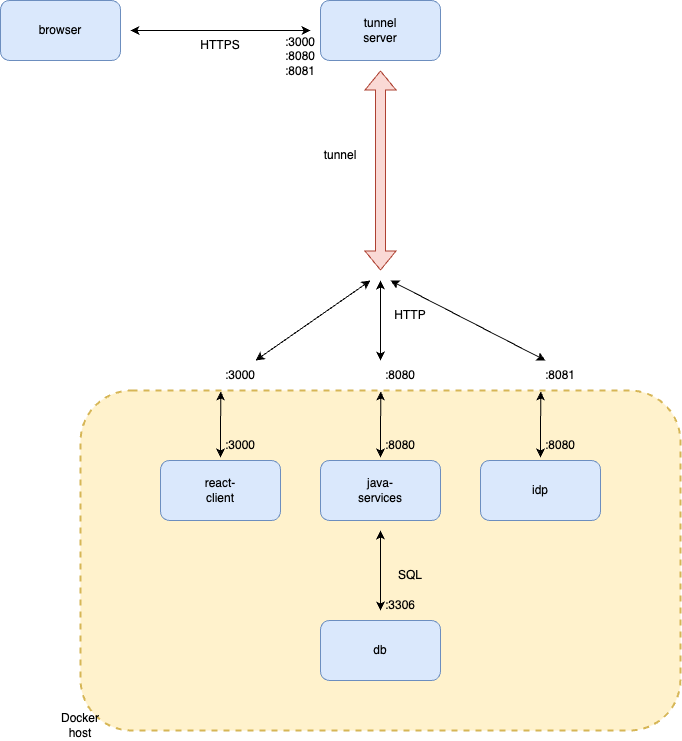

# Passkey workshop Docker Deployments

This directory contains scripts and configuration that is used to deploy the passkey workshop environment.

Note that deploying using the `../scripts` directory is deprecated.
Differences with ../scripts (power)shell scripts:

- a single docker compose file is used to deploy the whole environment
- A [devtunnel](https://learn.microsoft.com/en-gb/azure/developer/dev-tunnels/) can optionally be used to expose local docker containers to mobile clients

This document describes how to manually deploy the complete workshop environment, but this can also be done automatically with the deploy scripts:

- deploy.sh  - for use on macOS and Linux (including Windows Subsystem for Linux)
- deploy.ps1 - for use on Windows

Deployment can be used in two modes, controlled by the environment variable `DEPLOYMENT_ENVIRONMENT` with values:
- `localhost` - for a deployment running everything on localhost
- `devtunnel` - for a deployment running over a devtunnel (for access over the Internet using for instance a mobile phone)

## Required software

Except for the iOS clients, all components can be deployed using Docker containers and should run on Windows, Linux, and macOS.

To deploy the workshop, you will need to install some software.

- [Docker Desktop](https://www.docker.com/products/docker-desktop/) for running server components

and optionally:

- [devtunnel](https://learn.microsoft.com/en-us/azure/developer/dev-tunnels/get-started#install), for access to components over the Internet

Also note that for devtunnel, a GitHub, Azure, or Microsoft Account (MSA) is required.

When building iOS clients, additionally the following is required:
- MacOS 13 or newer
- Xcode 14.2 or newer for building iOS apps
- an Apple developer account with privileges to create associated domains capability
- an iPhone running iOS 16.3 or newer

## TL;DR

Detailed deployment instructions are listed below but for a quickstart, here's the TL;DR:

To deploy locally (only accessible on localhost):

1. install Docker
2. clone this repository
3. cd into /deploy
4. run the script in `./deploy.sh` (Linux, macOS) or `.\deploy.ps1` (Windows)
5. Point your browser to http://localhost:3000/

To deploy using a tunnel (accessible over the Internet):

1. install Docker and devtunnel
2. logon to devtunnel first (`devtunnel user login`) with your Microsoft or Github account via your browser, then return back to the console
3. clone this repository
4. cd to /deploy
5. copy the file `default.env` to `.env`
6. edit the `.env` file and set the variable `DEPLOYMENT_ENVIRONMENT` to `devtunnel`
7. run the script in `./deploy.sh` (Linux, macOS) or `.\deploy.ps1` (Windows).
8. Point your browser to the devtunnel endpoint, as instructed by the script output

Some notes:

- If on macOS and the `deploy.sh` script is complaining about your Apple Developer Team ID,
  edit the file `.env` and fill in the `DEVELOPMENT_TEAM` variable
- If on Windows and the `deploy.ps1` script is complaining that the script can not be loaded
  because it is not digitally signed, you need to relax the local execution policy as follows:

    Set-ExecutionPolicy -ExecutionPolicy RemoteSigned -Scope CurrentUser -force

See also Microsoft's documentation on [execution policies](https://learn.microsoft.com/en-us/powershell/module/microsoft.powershell.core/about/about_execution_policies)

You can also deploy manually, as per the instructions below.

# Deploy on localhost

Deploying everything on localhost is simple, as this uses defaults for everything:

1. From a terminal window, change into de deploy directory

2. Copy the example environment file

        cp default.env .env

3. Copy all component source files

For the demo application, copy these files:

	cp -r ../examples/clients/web/react/passkey-client/ react-app/source/
	cp -r ../examples/relyingParties/java-spring/ java-app/source/
	cp -r ../examples/IdentityProviders/KeyCloak/passkey_authenticator/ keycloak/source/

For the high-assurance banking application, copy these files:

	cp -r ../examples/IdentityProviders/KeyCloak/passkey_spi/ keycloak/bank_source/
	cp -r ../examples/clients/web/react/bank-client/ bank-react-app/source/
	cp -r ../examples/high_assurance/bank_app/ bank-java-app/source/

On Windows, use `Copy-Item -Force -Recurse` instead of `cp -r`.

3. Build and run your docker containers:

        docker compose up -d

4. Point your browser to

	http://localhost:3000/

for the demo application, or to

	http://localhost:3000/

for the high-assurance banking application.

# Deploy using a tunnel

For mobile clients we need to expose the docker containers to the Internet in order to use them from your mobile device.
This deployment is similar the localhost deployment, except that services are exposed on an HTTPS URL reachable from your mobile device instead of localhost.

This is what the tunneled workshop network looks like:



Here, we focus on deploying components necessary to run the mobile clients. The procedure to run the web clients is similar.

To deploy the mobile client:

1. From a terminal window, change into de deploy directory

2. If applicable, stop and remove any running containers:

        docker compose down

3. Copy the example environment file

        cp default.env .env

4. Edit the `.env` file and set the variable `DEPLOYMENT_ENVIRONMENT` to `devtunnel`

5. Copy the frontend code

        cp -r ../examples/clients/web/react/passkey-client/ react-app/source

6. Edit the file `react-app/source/public/.well-known/apple-app-site-association` with your AppID. For instance so it reads:

```bash
$ cat react-app/source/public/.well-known/apple-app-site-association 
{
  "webcredentials": {
    "apps": [
      "UVWXYZ1234.fyi.passkey.pawskeyUVWXYZ1234"
    ]
  }
}
```

where `UVWXYZ1234` is your Team ID.
Read [here](https://developer.apple.com/help/account/manage-your-team/locate-your-team-id/) how to locate your Team ID.

7. As the `passkey-client` source code has changed, rebuild the previously built image:

        docker compose build passkey-client

8. Copy the backend code

        cp -r  ../examples/relyingParties/java-spring/ java-app/source/

No source file changes are required here.

9. Create a tunnel.

Install [devtunnel](https://learn.microsoft.com/en-gb/azure/developer/dev-tunnels/get-started), and sign in using your github or Microsoft account:

	devtunnel user login

Create the tunnel:

	devtunnel create --allow-anonymous --labels passkey-workshop --host-header unchanged --origin-header unchanged

Note the tunnel ID that is assigned, for instance `abcd1234.euw`.

10. Create the following ports:

	devtunnel port create <your tunnel id>  -p 3000 --description 'app'
	devtunnel port create <your tunnel id>  -p 8080 --description 'api'
	devtunnel port create <your tunnel id>  -p 8081 --description 'idp'

11. Edit your .env file and set the values of `RP_ID`, `RP_ALLOWED_ORIGINS`, and `RP_ALLOWED_CROSS_ORIGINS` to your assigned tunnel endpoint.

Your tunnel endpoint is be derived from your tunnel id: `<your tunnel id>.devtunnels.ms`.

```
RP_ID=your-tunnel-endpoint
RP_ALLOWED_ORIGINS=your-tunnel-endpoint
RP_ALLOWED_CROSS_ORIGINS=your-tunnel-endpoint
```

Also edit the URL for your RP backend API, your IdP, and your redirect URI so it includes your tunnel hostname:

```
REACT_APP_RP_API=https://your-tunnel-endpoint:8080/v1
REACT_APP_OIDC=https://your-tunnel-endpoint:8081/realms/passkeyDemo/protocol/openid-connect
REACT_APP_REDIRECT_URI=https://your-tunnel-endpoint:3000/oidc/callback
```

12. To run the complete environment,

run your docker containers:

        docker compose up -d

and host your tunnel:

	devtunnel host <your tunnel id>

13. Point your browser to

	https://your-tunnel-endpoint:3000/

14. Verify that everything works before proceeding with the iOS client code in XCode.

15. Start XCode with the iOS sample code in directory `../examples/clients/mobile/iOS/PawsKey`

16. In the Pawskey target, on the "Signing and Capabilities" tab, under "Signing", select your development team from the dropdown.

17. In Project Navigator, select "Configuration/Constants" and update the hostname in the `API_BASE_URI` and `RP_ID` constants to match your tunnel endpoint. For instance:

        API_BASE_URI = your-tunnel.com:8080/v1
        RP_ID = your-tunnel-endpoint.com

18. Build and run the Pawskey application on your iOS device.

# Cleaning up

When done, stop and remove all containers:

        docker compose down

Note that your assigned tunnel hostname will expire in 30 days, after which you need to create a new tunnel.

## Deleting passkeys

When done, you may want to delete all passkeys generated for your RP ID.

In Chrome on MacOS, you can delete passkeys generated locally using chrome://settings/passkeys.
Note that on MacOS, these passkeys aren't synced to your Google Account.

If you used the hybrid flow to use your Android device as an authenticator however, passkeys *are* synced to your Google Account.
To delete these passkeys using your Android device, navigate to _Settings_, _Passwords & accounts_, _Passwords_.
You will find any synced passkeys under the name of your RP ID.

Lastly, you can delete passkeys generated on your security key using chrome://settings/securityKeys (select "Sign-in data").
